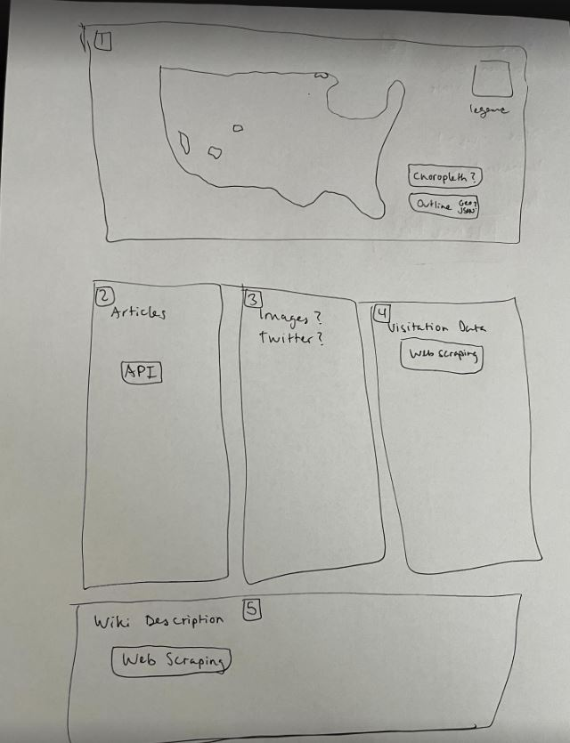

## National Parks Web App Project Proposal
National Parks Data Project
Team Members: Paul Brichta, Lindsey Wolterstorff, and Sam Holland

We’ll get national park geojson data from:
nps boundary | nps boundary | National Park Service (arcgis.com)
Visitation numbers will be embedded in the main map, data found here:
Visitation Statistics - Social Science (U.S. National Park Service) (nps.gov)

Create a map with geojson boundaries of each park from the above nps boundary data link. 
-	Event handler for clicks: Show park properties like name, visitation numbers, etc.
-	Map will load based on accessing device’s geolocation with:
-	Webpage will have a table below the map with articles, images, tweets, links, description, etc.
    - API for articles: https://newsapi.org/

Choropleth visualization: number of national parks by state

Maybe divide number of parks by square miles of the state

Table with an ordered list of parks by park density

Page Layout:

Actions:
Create repo and pages

